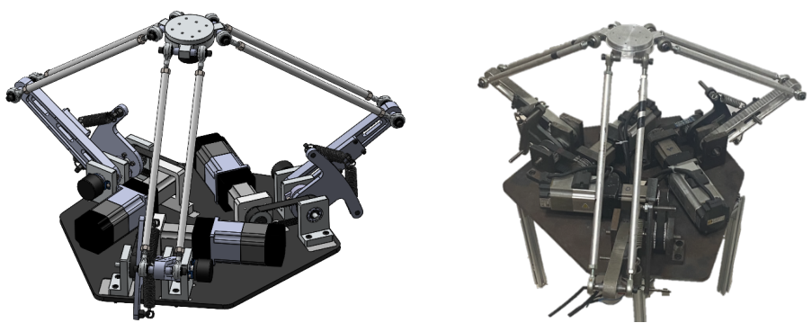

# THIẾT KẾ VÀ ĐIỀU KHIỂN ROBOT DELTA CỘNG TÁC VỚI CON NGƯỜI

- [THIẾT KẾ VÀ ĐIỀU KHIỂN ROBOT DELTA CỘNG TÁC VỚI CON NGƯỜI](#thiết-kế-và-điều-khiển-robot-delta-cộng-tác-với-con-người)
  - [1. Mục tiêu đồ án](#1-mục-tiêu-đồ-án)
  - [2. Thiết kế cơ khí](#2-thiết-kế-cơ-khí)
  - [3. Thiết kế hệ thống điện](#3-thiết-kế-hệ-thống-điện)
  - [4. Mô hình hoá và thiết kế bộ điều khiển](#4-mô-hình-hoá-và-thiết-kế-bộ-điều-khiển)
  - [5. Xây dựng chương trình điều khiển Robot](#5-xây-dựng-chương-trình-điều-khiển-robot)
    - [5.1. Điều khiển robot thông qua mạng RTEX](#51-điều-khiển-robot-thông-qua-mạng-rtex)
    - [5.2. Khung dữ liệu trong mạng](#52-khung-dữ-liệu-trong-mạng)
    - [5.3. Xây dựng chương trình chạy Robot trên Ubuntu](#53-xây-dựng-chương-trình-chạy-robot-trên-ubuntu)
    - [5.4. Giao diện điều khiển](#54-giao-diện-điều-khiển)
  - [6. Thực nghiệm](#6-thực-nghiệm)

## 1. Mục tiêu đồ án

Đồ án hướng tới việc xây dựng cánh tay robot cho Delta Manipulator. Robot có khả năng trợ lực giúp con người nâng vật nặng từ điểm bắt đầu đến điểm kết thúc. Con người sẽ điều hướng cho robot thông qua tương tác vật lý.

## 2. Thiết kế cơ khí

Mô hình robot được xây dựng sau khi tính toán, thiết kế và gia công. Robot chịu tải được 10kg và sử dụng cơ cấu Series Elastic Actuator để tiếp nhận lực (Sử dụng phần mềm Solidworks và các phương pháp gia công cơ khí để xây dựng robot). 

## 3. Thiết kế hệ thống điện

Bộ điều khiển chính
- Computer: đóng vai trò là bộ điều khiển chính của hệ thống, điều khiển phân cấp đến controller là RTEX Master Board
- RTEX Master: điều khiển ba bộ AC Servo thông qua mạng RTEX

Bộ khuếch đại: Gồm ba Driver điều khiển động cơ

Động cơ: gồm 3 AC Servo Motor tương ứng với ba khớp tay máy

## 4. Mô hình hoá và thiết kế bộ điều khiển

Giải bài toán động học cho robot để giải quyết bài toán điều khiển. Sử dụng Matlab Simulink để mô hình hoá và kiểm tra thuật toán.
Robot sử dụng thuật toán Point to point để bám quỹ đạo và ứng dụng thuật toán Admitance Control cho bài toán tương tác với con người.

## 5. Xây dựng chương trình điều khiển Robot
### 5.1. Điều khiển robot thông qua mạng RTEX

Sơ đồ tổng quan mạch gồm ba khối chính:
- PIC33EP521MU814: vi điều khiển trung tâm của board
- MNM1221: RTEX Protocol IC, đóng vai trò giao thức kết nối mạng RTEX
- KSZ8041: PHY(Physical Layer Chip), tạo lớp vật lý đóng vai trò truyền nhận dữ liệu.

### 5.2. Khung dữ liệu trong mạng

Đọc Datasheet của MNM1221 để thiết lập các cấu hình và chức nằng cũng như mode chạy AC Servo PANASONIC.
### 5.3. Xây dựng chương trình chạy Robot trên Ubuntu

Xây dựng chương trình điều khiển Robot chạy trên nền tảng Ubuntu, sử dụng giao thức USB HID để điều khiển RTEX Board. Dùng để test chương trình điều khiển, chương trình có sử dụng thread khác nhau để có thể điều khiển và đọc dữ liệu.

### 5.4. Giao diện điều khiển

Xây dựng giao diện điều khiển trên MFC, giao diện có các chức năng điều khiển robot cũng như lấy các giá trị được trả về từ encoder, thiết lập quỹ đạo cho Robot.

## 6. Thực nghiệm
Kết quả thực nghiệm sai số về mặt vị trí theo thời gian khi robot bám theo quỹ đạo hình tròn trong mặt phẳng OXY

Kết quả thực nghiệm sai số về mặt vị trí theo thời gian khi robot bám theo quỹ đạo hình tròn trong mặt phẳng 

